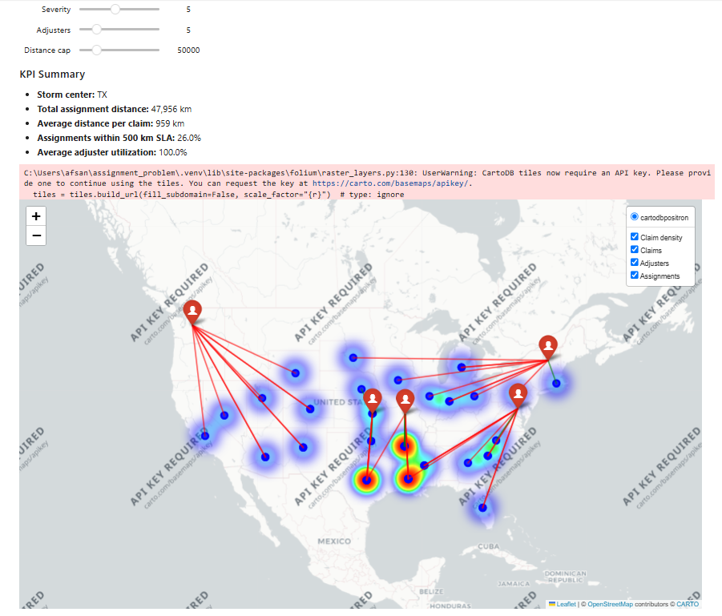

# Storm Claims Adjuster Allocation Optimization

A small operations-research demo that assigns insurance claims to field adjusters while balancing travel distance, adjuster capacity, and an optional travel-distance budget.

The project uses **Google OR-Tools** for mixed-integer optimization and **Folium** for an interactive map. Notebook controls let you change storm severity, number of available adjusters, and the maximum total travel distance.

## Demo



## Key Features

- Formulates claim-to-adjuster allocation as a binary mixed-integer optimization problem.
- Minimizes total geographic assignment distance subject to adjuster capacity and system-wide distance constraints.
- Generates synthetic storm scenarios with geographically concentrated claim demand.
- Tracks operational KPIs including assignment distance, SLA compliance, and adjuster utilization.
- Provides an interactive geographic decision-support visualization using Folium and ipywidgets.

## What the model does

For each simulated claim, the optimization model selects exactly one adjuster.

**Objective**

Minimize total assignment travel distance:

\[
\min \sum_{i \in Claims}\sum_{j \in Adjusters} d_{ij}x_{ij}
\]

**Constraints**

- Every claim is assigned to exactly one adjuster.
- Each adjuster has a maximum claim capacity.
- Total assignment distance cannot exceed the selected distance budget.
- Assignment variables are binary.

> This is a demonstration model using synthetic data and state-level coordinates. It is not intended to represent a production claims-dispatch system.

## Improvements in this version

Compared with the initial prototype, this version:

- uses **binary decision variables** instead of a continuous LP relaxation;
- checks solver status before reading a solution;
- uses reproducible random-number generation;
- separates **distance** from **monetary cost** terminology;
- computes KPIs from actual binary assignments;
- simulates a more realistic storm footprint by concentrating claims around a randomly selected storm region;
- separates data generation, optimization, KPI calculation, and visualization into functions;
- adds clearer map layers and tooltips.

## Repository structure

```text
storm-claims-adjuster-optimization/
├── storm_claims_optimization.ipynb
├── storm_claims_optimization.py
├── requirements.txt
├── .gitignore
└── README.md
```

## Setup

Python 3.10+ is recommended.

```bash
python -m venv .venv
```

Activate the environment.

**Windows**

```bash
.venv\Scripts\activate
```

**macOS/Linux**

```bash
source .venv/bin/activate
```

Install dependencies:

```bash
pip install -r requirements.txt
```

Then start Jupyter:

```bash
jupyter notebook
```

Open `storm_claims_optimization.ipynb` and run the cells from top to bottom.

## Interactive controls

- **Storm Severity** — controls the number of simulated claims.
- **Adjusters** — controls the number of available field adjusters.
- **Distance Budget** — limits total claim-to-adjuster travel distance in kilometres.

The dashboard reports:

- total assignment distance;
- average distance per claim;
- percentage of assignments within the 500 km SLA threshold;
- average adjuster utilization.

## Modeling assumptions

This portfolio project intentionally keeps the model small and interpretable:

- Claims and adjusters are simulated rather than loaded from real insurance data.
- State coordinates are approximate representative points, not street addresses.
- Travel distance is geodesic distance, not road-network travel time.
- Each claim has equal workload.
- Adjuster capacity is evenly distributed.
- The SLA threshold is fixed at 500 km.
- The distance budget is a modeling constraint, not a dollar budget.

## Possible extensions

A production-oriented version could add claim severity, adjuster skills, heterogeneous capacity, service-time estimates, road travel times, regional restrictions, workload balancing, multiple storm scenarios, and explicit monetary travel costs.

## Tech stack

Python · pandas · NumPy · Google OR-Tools · geopy · Folium · ipywidgets

## Author

Afsane Amiri
